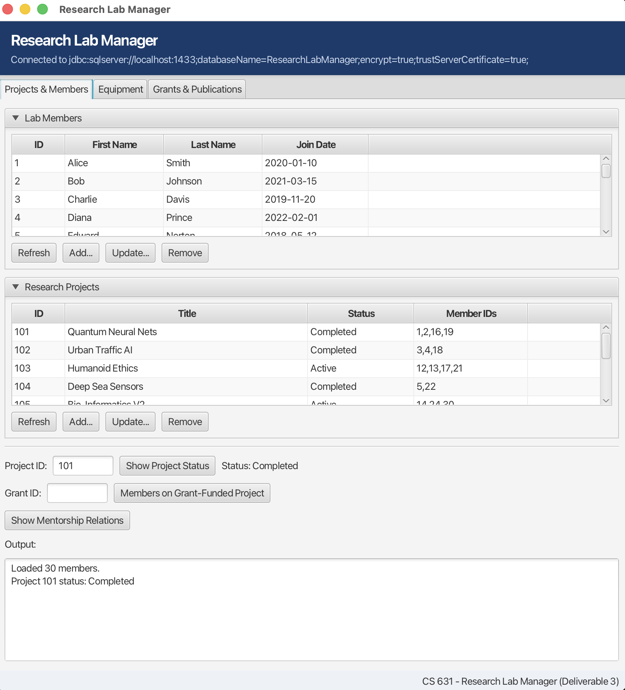
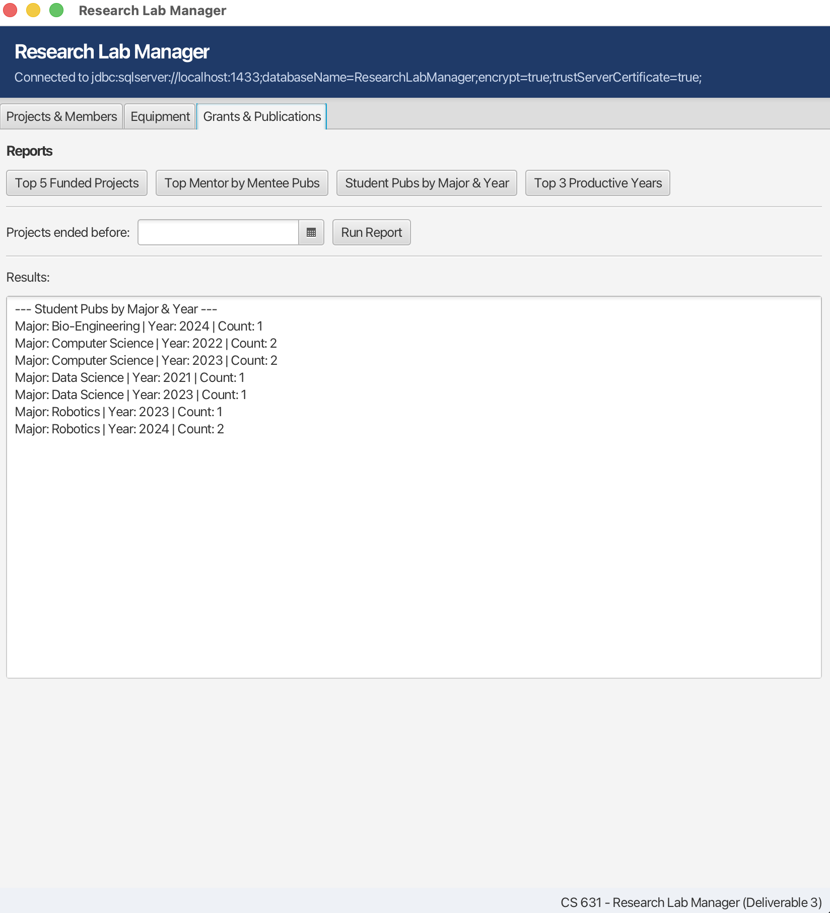

# Research Lab Manager 🔬📊

Hey there! This is a full-stack database project I built for my **CS 631: Data Management Systems Design** class at NJIT.

The goal of this project was to take a messy "mini-world" of a university research lab—which was drowning in scattered spreadsheets—and design a centralized, production-ready relational database application from scratch. The system manages the entire lab lifecycle: tracking student/faculty hierarchies, equipment checkout limits, research publications, and millions of dollars in grant funding.

---

## The Tech Stack I Used 💻

* **Database:** Microsoft SQL Server (Run inside a containerized **Docker** environment for clean, repeatable testing)
* **Backend:** Java SE 17
* **Database Connectivity:** JDBC using a modular **DAO (Data Access Object)** pattern
* **Frontend UI:** JavaFX + FXML (Clean, practical, tab-based layout)
* **Build Tool:** Maven

---

## Quick-Scan Engineering Decisions (For Recruiters) ⚡

If you are a curious DB analyst checking out my portfolio, here is a quick look at the core architectural challenges I solved and why I made these choices:

| Tech Challenge | Design Trade-Off Chosen | Real-World Engineering Result |
| :--- | :--- | :--- |
| **Data Pollution in Subclasses** | Multiple Tables (Subclass & Superclass) approach | Students only hold student data; faculty only hold faculty data. |
| **Relational Data Redundancy** | Bridge tables with Composite Unique Constraints | Physically prevents double-booking members to projects or papers. |
| **Database Injection Risks** | Strict JDBC Parameterized `PreparedStatements` | Complete insulation against malicious SQL injection tactics. |
| **Network Round-Trip Latency** | Advanced T-SQL String Aggregations (`STRING_AGG`) | Bundles list items server-side into a single row cell for faster rendering. |

---

## Step-by-Step Development Journey 🛠️

I engineered this project across three distinct lifecycle phases, solving unique constraints at each step:

### Phase 1: Conceptual Design & Requirements Analysis (The Blueprint)
*Reference files verbatim: `ProjDescription-ResearchLabManager-2-1.pdf` and `Deliverable 1_ Project Analysis and Conceptual Schema (1).docx`*

Before writing a single line of code, I had to dissect the lab's rules and map them out visually in an **Enhanced Entity-Relationship (EER)** Diagram (`ER Diagram.png.pdf`). 

* **The Problem (The Personnel Pool):** The lab has different types of people (Faculty, Students, External Collaborators) who share some basic info (like Names and IDs) but have completely different operational roles.
    * **My Solution:** I designed an **IS-A Disjoint Specialization Hierarchy**. This kept the shared data at the superclass level but forced members strictly into one sub-category to hold unique details (like a student's major or a professor's department).
* **The Problem (Entity vs. Unit Cataloging):** The lab has general equipment models (like "Oculus Rift S1"), but needs to track individual physical units ("Unit 1", "Unit 2") which have their own specific purchase dates and statuses.
    * **My Solution:** I modeled `Device` as a **Weak Entity** dependent on a strong `Equipment` parent entity. This means a device's unique key is a composite of the Equipment ID + Device Number, perfectly matching real-world lab inventory.
* **The Problem (Complex Business Constraints):** Business constraints dictated that a student can only have one mentor, students are never allowed to mentor faculty, and every single lab member must be assigned to at least one project.
    * **My Solution:** I used a **recursive relationship** on the Lab Member table and restricted the cardinality to exactly `1` on the mentee side to enforce the mentorship limit. I also applied **Total Participation (double lines)** on the Lab Members side of the `Works On` relationship to ensure everyone was working on a project. To automatically prevent students from leading projects, I connected the `Leads` relationship **strictly to the Faculty subclass**.

### Phase 2: Logical Relational Mapping & Normalization (The Schema)
*Reference file verbatim: `Project Deliverable 2 [Mapping the ER Diagram to a Relational Schema].pdf`*

Next, I converted the abstract EER diagram into a logical relational schema consisting of 12 normalized tables and wrote the physical SQL DDL setup scripts.

* **My Mapping Strategy:** For the personnel hierarchy, I executed the **Multiple Tables Approach**. I created a base `LabMembers` table and linked the `Student`, `Faculty`, and `Collaborators` tables to it using their `MemberID` as both the Primary Key and a Foreign Key with `ON DELETE CASCADE`. This stops data pollution right at the door.
* **Handling Many-to-Many ($M:N$) Relations:** Relationships like `WorksOn` (members on projects) and `Author` (members on papers) became separate bridge tables. I added a **composite UNIQUE constraint** on these tables so the database physically blocks someone from being added to the same project or paper twice.
* **Overcoming SQL Dependency Traps:** When running a clean database setup, table creation order matters because of Foreign Keys. I structured my DDL execution script systematically so independent tables (like `Equipment` and `Publications`) load first, entirely preventing constraint errors. I also baked data-integrity rules directly into the DDL, guaranteeing that timestamps (`EndDate >= StartDate`) and numbers (grant budgets $> 0$) remained bulletproof.

### Phase 3: Physical Implementation & UI (Making It Work)
*Reference file verbatim: `Deliverable 3_ Database Implementation and Application.pdf`*

For the final phase, I spun up the live infrastructure, populated the tables with interconnected sample data, and built a desktop UI app to interface with it.

* **Clean Architecture (DAO Pattern):** I used the **DAO Pattern** (`LabManagerDAO.java`) to keep all my SQL queries completely separated from my UI view logic (`LabManagerController.java`). This makes the code easier to maintain and test. Plus, I used **parameterized PreparedStatements** exclusively to eliminate SQL Injection risks.
* **Real-Time State Tracking:** To find out who is "currently using" equipment for lab reports, I wrote query logic that looks for active reservation semantics by evaluating real-time states where the usage table's `EndDate IS NULL`.
* **SQL Optimization:** To keep the frontend fast, I used SQL Server's `STRING_AGG` function to bundle list variables (like all Member IDs working on a single project) into a single row cell, cutting down on unnecessary database round-trips.

---

## Application Features & Interface 📊

The app is split into three simple, menu-driven tabs that mirror real day-to-day lab operations:

1.  **Projects & Members:** Full CRUD operations to add, view, update, or remove personnel and assignments safely.
2.  **Equipment Tracking:** A dedicated dashboard to monitor physical hardware units and see who is currently using them.
3.  **Grants & Publications Analytics:** Heavy-lifting SQL queries that compute:
    * The top 5 highest-funded research projects.
    * The most impactful mentors based on their cumulative mentee publication metrics.
    * Annual student publication outputs grouped automatically by academic majors and publication years.

---

## Visual Previews 📸

*(Pro-tip for my repo visitors: check out the interface screenshots below showing the live data calculations!)*

### Projects & Members Dashboard

*This tab manages the core personnel records and aggregates active member IDs on research teams.*

### Analytical Reporting Dashboard

*This tab handles complex reporting math, dynamically calculating the top-funded projects and student output metrics.*

---

## How to Spin This Up Locally 🚀

1.  **Start the SQL Server Container:**
    Ensure Docker Desktop is running, then pull and execute the Microsoft SQL Server instance:
    ```bash
    docker run -e "ACCEPT_EULA=Y" -e "MSSQL_SA_PASSWORD=YourSecurePassword123!" -p 1433:1433 --name mssql-labmanager -d [mcr.microsoft.com/mssql/server:2025-latest](https://mcr.microsoft.com/mssql/server:2025-latest)
    ```
2.  **Seed the Database:** Copy your database seed structure into the Docker file tree or run the initialization script directly via your terminal tools to inject the pre-built dataset:
    ```bash
    docker cp ResearchLabManager.bak mssql-labmanager:/var/opt/mssql/data/
    # Run your standard RESTORE DATABASE workflow inside the container
    ```
3.  **Launch the App:** Compile target dependencies using Maven and launch the application entry point:
    ```bash
    mvn clean compile javafx:run
    ```
